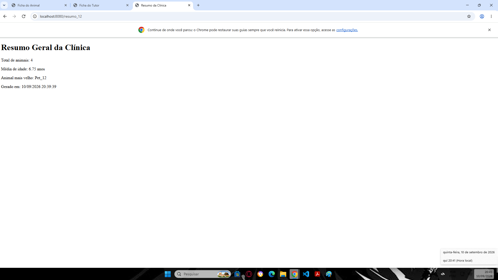
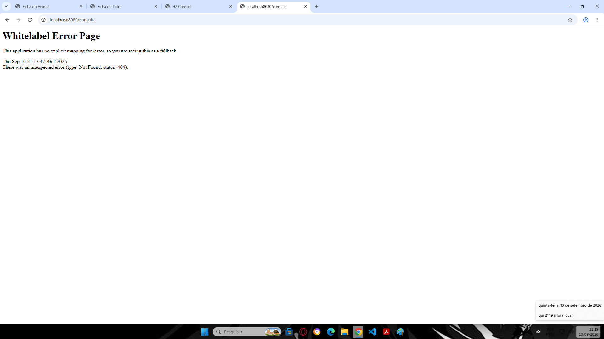
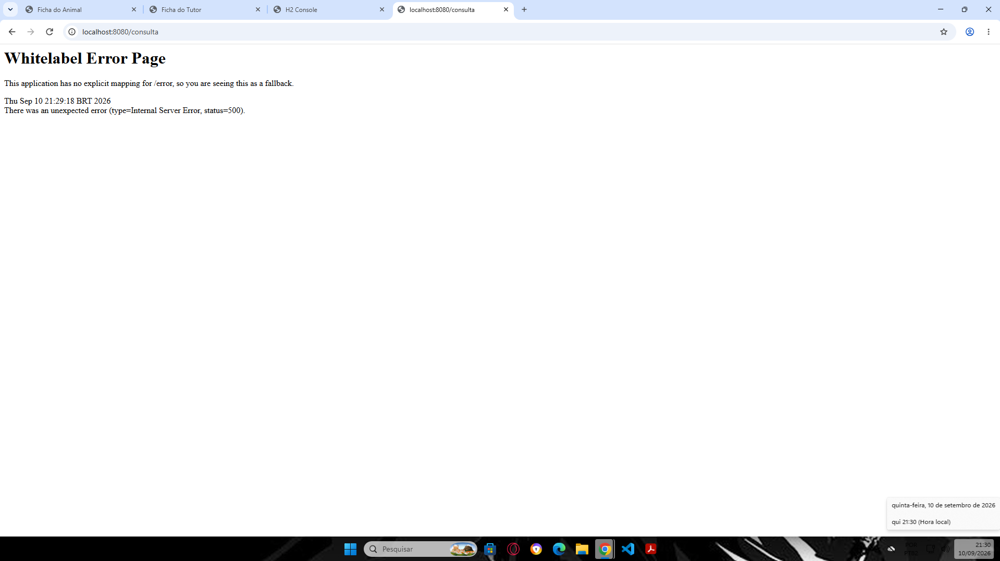

# Evidências de Execução (Parte A)

## Ficha do Animal


## Ficha do Tutor


## Resumo da Clínica


## Banco de Dados (Console H2)


---

# Parte B — Planejamento da camada de controle

| Ação | Tipo de requisição | URL completa | Mapeamento (anotação) | Template |
| :--- | :--- | :--- | :--- | :--- |
| Mostrar a ficha do animal | GET | http://localhost:8080/ficha_12 | @GetMapping("/ficha_12") | ficha.html |
| Mostrar a ficha do tutor | GET | http://localhost:8080/tutor_12 | @GetMapping("/tutor_12") | tutor.html |
| Mostrar o resumo da clínica | GET | http://localhost:8080/resumo_12 | @GetMapping("/resumo_12") | resumo.html |
| Cadastrar um novo animal | POST | não existe | não existe | não existe |

### B.1
O Spring utiliza a **URL** (o caminho/path da requisição) para diferenciar a execução entre os métodos `ficha()` e `resumo()`. O verbo HTTP isoladamente não bastaria porque ambas as rotas utilizam o mesmo verbo (**GET**); sem a diferenciação pelo caminho da URL, o framework não saberia qual método acionar.

---

# Parte C — Depuração

| Item | É defeito? | Sintoma observado (mensagem literal) | Causa (o que o Spring/Thymeleaf tentou fazer) | Correção aplicada |
| :---: | :---: | :--- | :--- | :--- |
| **1** | Sim | `There was an unexpected error (type=Not Found, status=404).` | A classe não possui a anotação `@Controller`, portanto o Spring não a registrou como Bean nem mapeou suas rotas. | Adicionada a anotação `@Controller` acima da classe `ConsultaController`. |
| **2** | Não | Nenhum (a rota responde normalmente). | O Spring MVC infere e adiciona automaticamente a barra inicial `/` em `@GetMapping("consulta")`, mapeando corretamente para `/consulta`. | Nenhuma alteração necessária (item correto). |
| **3** | Sim | `org.thymeleaf.exceptions.TemplateProcessingException: Exception evaluating SpringEL expression: "animal.nome"` | O controller adicionou o objeto no `Model` com a chave `"bicho"`, mas o HTML tentou acessar a chave `${animal.nome}` que estava nula. | Alterada a chave no controller para `model.addAttribute("animal", repository.buscarPorId(1));`. |
| **4** | Sim | `org.thymeleaf.exceptions.TemplateInputException: Error resolving template [consulta.html], template might not exist...` | O Thymeleaf View Resolver adiciona o sufixo `.html` automaticamente. Ao retornar `"consulta.html"`, ele procurou pelo arquivo `consulta.html.html`. | Alterado o retorno do método no controller para `return "consulta";`. |
| **5** | Sim | Exibe o texto literal `${animal.especie}` impresso diretamente na página do navegador. | Faltou a diretiva `th:text`. Sem o atributo do Thymeleaf, a sintaxe `${...}` não é interpretada e é tratada como HTML estático puro. | Alterada a tag no HTML para `<p th:text="${animal.especie}">espécie do animal</p>`. |

### D.1 — Histórico do Git e Evidências



Saída do comando `git log --oneline`:
```0388cbb (HEAD -> main) parte-d: defeitos corrigidos
9f988c4 parte d: codigo com defeitos
fee6a26 parte-a: sistema funcionando
28c55fd (origin/main) parte-a: projeto configurado

## E.2 — Prova Experimental (Afirmações B e C)

### Experimento (b) — Verbo HTTP
* **Procedimento**: Enviada requisição **POST** para `http://localhost:8080/ficha_12` via terminal (`curl -i -X POST http://localhost:8080/ficha_12`).
* **Evidência do Terminal**:
  ```text
  HTTP/1.1 405
  Allow: GET
  Content-Type: application/json

  {"timestamp":"2026-09-11T00:49:02.951Z","status":405,"error":"Method Not Allowed","path":"/ficha_12"}